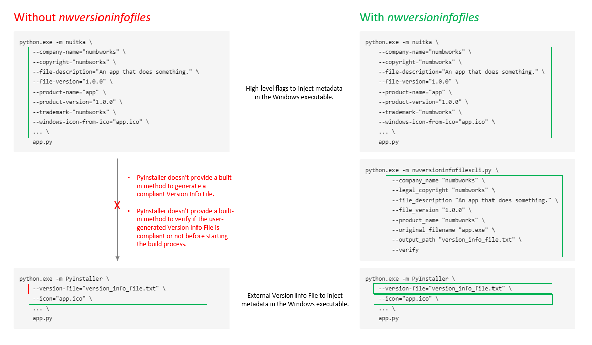

# nwversioninfofiles
Contact: numbworks@gmail.com

## Revision History

| Date | Author | Description |
|---|---|---|
| 2026-01-21 | numbworks | Created. |
| 2026-05-11 | numbworks | Last update (2.0.0). |

## Introduction

`nwversioninfofiles` is a library that facilitates the creation of Version Info Files for PyInstaller.

## Architecture

A primary difference between `pyinstaller` and `nuitka` is how they handle metadata: `pyinstaller` relies on Version Info Files, which are difficult to modify on-the-fly, whereas `nuitka` uses high-level command-line flags. Furthermore, `pyinstaller` provides no way to verify these files before the build begins.

`nwversioninfofiles` fills the gap between both by simplifying metadata management/validation, which provides even more value when the user needs to integrate both tools in the same CI/CD pipeline.

## Example files

Here three examples of Version Info Files and the template used by this library:

1. [versioninfofile_example1.txt](ExampleFiles/versioninfofile_example1.txt)
2. [versioninfofile_example2.txt](ExampleFiles/versioninfofile_example2.txt)
3. [versioninfofile_example3.txt](ExampleFiles/versioninfofile_example3.txt)
4. [versioninfofile_template.txt](ExampleFiles/versioninfofile_template.txt)

## See Also: `developmentguide`

To get started with this project as a developer, please give a look to the following document:

- [docs-developmentguide-python.md](SeeAlso-developmentguide/docs-developmentguide-python.md)

## See Also: `asciibannermanager`

This project includes portions of the `asciibannermanager` project, which is documented here:

- [docs-asciibannermanager.md](SeeAlso-asciibannermanager/docs-asciibannermanager.md)

## See Also: `nwbuilders`

This project includes portions of the `nwbuilders` project, which is documented here:

- [docs-nwbuilders-python.md](SeeAlso-nwbuilders/docs-nwbuilders-python.md)

## See Also: `nwmakefiles`

This project includes portions of the `nwmakefiles` project, which is documented here:

- [docs-nwmakefiles.md](SeeAlso-nwmakefiles/docs-nwmakefiles.md)

## Markdown Toolset

Suggested toolset to view and edit this Markdown file:

- [Visual Studio Code](https://code.visualstudio.com/)
- [Markdown Preview Enhanced](https://marketplace.visualstudio.com/items?itemName=shd101wyy.markdown-preview-enhanced)
- [Markdown PDF](https://marketplace.visualstudio.com/items?itemName=yzane.markdown-pdf)